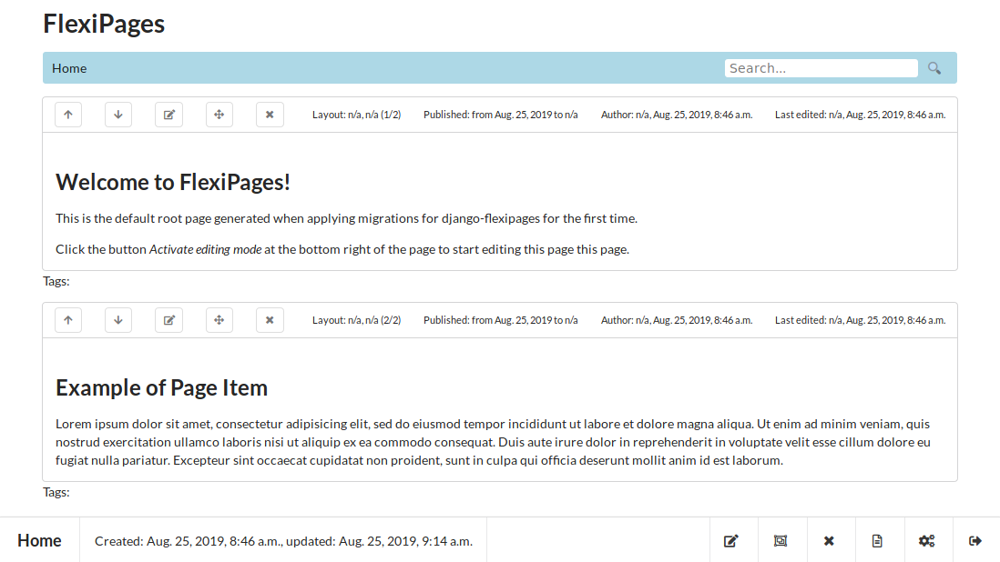

# django-flexipages
A minimalist CMS that gives an enhanced alternative to the Django flatpages app.



This tool was developed to overcome the limitations of the Django flatpages framework that makes it often unusable even for small static websites.


## Features

As a simple CMS tool it provides a mean to manipulate blocks of contents that you can arrange the way you want on each page, with the following features:
* built-in support of text search on any static contents
* built-in support for easy, customizable server side caching
* implicit hierarchy of pages according to the SEO-friendly path you give to each of your pages
* ability to layout each page with as many zones (group of contents) as you want
* WYSIWYG editor for contents (can be turned off in case you need special raw HTML)
* ability to use Django templating engine, Markdown, or JavaScript to render each contents
* syntax highlighting for Django templates
* management of start/end date of publishing for each contents
* automatic sitemap
* uses the Django admin app to edit pages and their contents, but also provides some editing tools to move blocks of content around on a page
* each page item (=block of contents) can be tagged
* each page can be tagged (used for keywords meta in HTML)
* each block of contents can be published on many pages
* allows creation of pages that requires an authentication
* tools for managing menus to navigate the hierarchy of pages
* dead simple management of editing rights: contents editors, site admin and site designer
* multi-site management for templates and pages
* online management of page templates (no access to the server file system required)
* inline filtering of page contents based on tags included
* no limit to site design: you are in full control of the template of each page
* 100% clean HTML, no special CSS classes or HTML tags required
* page templating system based on Django template engine that includes inheritance and inclusion mechanisms for minimum duplication of HTML code
* ability to manage several site layouts based on type of device (desktop, tablet or smartphone)
* per site configuration options 

A specificity of this minimalist CMS lies in the fact that the blocks of contents have no structure.
All blocks are structurally equal, whatever they represent: the content is always a simple string.
This string however can be interpreted and rendered in different fashions: HTML, Django template, Markdown (with most GitHub extensions), JavaScript.
There are no special blocks for inserting video, image, collection of objects, etc.
You need a special formatting for a collection of videos? Make blocks with the video URL as the only content instead of an HTML &lt;video&gt; tag, and then use a dedicated template fragment to adequately render those blocks.

The following features are on their way:
* automatic RSS feeds
* contact form
* pagination of blocks of contents
* ability to inject dynamic context (via API calls) to any rendered page in order to insert dynamic contents into a static page


## Disclaimer

*FlexiPages* is in alpha stage. As such its API as well as its DB schema could radically change without notice.
 
If you are looking for a full featured CMS with complex permission management, strict data structure definitions, and others bells and whistles, *FlexiPages* is not for you!
That said, if you have a small or large number of static pages whose contents needs to be fully searchable, or you need a tool that ease inline editing of static contents you might have found what you were looking for.


## Getting Started

### Setting up the Development Environment
Clone this repository and prepare the environment for the first run:
* `pip install -r requirements.txt -r requirements-dev.txt`
* `python manage.py collectstatic --noinput`
* `python manage.py migrate`
* `python manage.py createsuperuser`

### Running the Development Server
Once the development environment is setup, start the development server:
* `python manage.py runserver`

### Setting up the Domain of the Default Site to localhost
Once you have a running server:
* login into the admin by opening you browser at http://localhost:8000/admin/ (use the same login as the one provided to the `createsuperuser` command above)
* edit the default site by navigating to http://localhost:8000/admin/sites/site/1/change/, replacing the domain name with `localhost:8000`, and saving the modification 
* check that everything is working by visiting the default root page http://localhost:8000, which is created when applying the migrations for *django-flexipages* for the first time

### Create your Very First Page
Once you have a running server:
* login into the admin by opening you browser at http://localhost:8000/admin/ (use the same login as the one provided to the `createsuperuser` command above)
* navigate to http://localhost:8000/admin/flexipages/page/add/ to create your very first page
* add a new page (use the `flexipages/pages/base.html` template for now)
* visit the page at http://localhost:8000/<you/page/to/path/>
* click the button `Activate editing mode` at the bottom right of the page to start editing and adding items to your page 

### Django Settings
Please have a close look at the django settings examples in `sites\settings.py` and `sites\local_dev\settings.py`. Here are the interesting bits of the provided example:
```python
from flexipages.config import *

INSTALLED_APPS = [*FLEXIPAGES_REQUIRED_APPS, 'django.contrib.staticfiles', 'flexipages.apps.FlexiPagesConfig' ]

MIDDLEWARE = [
    # ...
    'django_user_agents.middleware.UserAgentMiddleware',
]

TEMPLATES = [
    {
        'BACKEND': 'django.template.backends.django.DjangoTemplates',
        'DIRS': [],
        'APP_DIRS': False,
        'OPTIONS': {
            'loaders': [
                'django.template.loaders.filesystem.Loader',
                'django.template.loaders.app_directories.Loader',
                'dbtemplates.loader.Loader',
            ],
            'context_processors': [
                'django.template.context_processors.debug',
                'django.template.context_processors.request',
                'django.contrib.auth.context_processors.auth',
                'django.contrib.messages.context_processors.messages'
            ],
        },
    },
]

AUTHENTICATION_BACKENDS = (
    'rules.permissions.ObjectPermissionBackend',
    'django.contrib.auth.backends.ModelBackend',
)

CKEDITOR_CONFIGS = {
    'default': {
        'disableNativeSpellChecker': False,
        'entities': False,
        'width': '100%',
        'height': '500px',
        'toolbar': 'Custom',
        'toolbar_Custom': [
            ['Maximize', 'ShowBlocks', '-', 'Source'],
            ['Cut', 'Copy', 'Paste', 'PasteText', 'PasteFromWord', '-', 'Undo', 'Redo'],
            ['Find', 'Replace'],
            ['Styles', 'Format', 'Font', 'FontSize'],
            ['Bold', 'Italic', 'Underline', 'Strike', 'Subscript', 'Superscript', '-', 'CopyFormatting',
             '-', 'TextColor', 'BGColor', '-', 'RemoveFormat'],
            ['NumberedList', 'BulletedList', '-', 'Outdent', 'Indent', '-', 'Blockquote', '-',
             'JustifyLeft', 'JustifyCenter', 'JustifyRight', 'JustifyBlock'],
            ['Link', 'Unlink', 'Anchor', 'Image', 'Table', 'HorizontalRule', 'Smiley', 'SpecialChar'],
        ]
    }
}

FLEXIPAGES_CACHES = {
    'dbtemplates': {
        "BACKEND": "django.core.cache.backends.locmem.LocMemCache",
        "LOCATION": "dbtemplates",
    },
    'flexipages': {
        "BACKEND": "django.core.cache.backends.locmem.LocMemCache",
        "LOCATION": "flexipages",
    },
}
CACHES.update(FLEXIPAGES_CACHES)
FLEXIPAGES_PAGES_CACHE_ALIAS = 'flexipages'
```

In order to catch any path with *FlexiPages*, add `path('', include('flexipages.urls'))` to you root 'urls.py' which could look like this:
```python
from django.conf.urls import include
from django.contrib import admin
from django.urls import path

urlpatterns = [
    path('admin/', admin.site.urls),
    path('', include('flexipages.urls')),
]
```

The `admin.site.urls` are mandatory, but you may use an alternative admin site ([see doc](https://docs.djangoproject.com/en/2.2/ref/contrib/admin/#multiple-admin-sites-in-the-same-urlconf)). Please take care of putting the catch-all pattern for *FlexiPages* URLs at the very end of `urlpatterns`.

You may use a path prefix for pages managed by *FlexiPages*:
```python
urlpatterns = [
    # ...
    path('flexipages', include('flexipages.urls')),
]
```